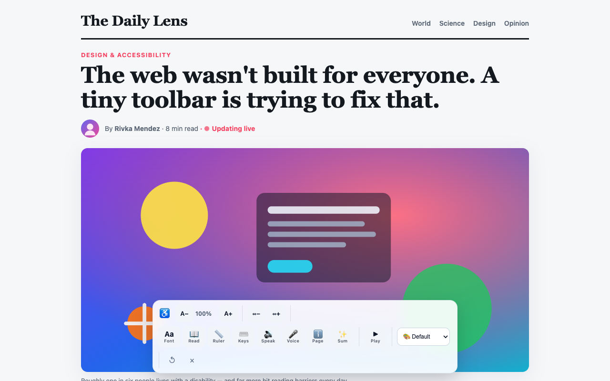

# A11y Companion

A personal accessibility toolbar that works on **any** website. Install it once and it
follows you across the web, applying your reading and vision preferences on every page.

> This is not just for blind users. It is for anyone with dyslexia, ADHD, low vision,
> color blindness, light sensitivity, aging eyes, or anyone who simply wants the web to
> be easier to read.

---

## Try it

**▶ [Live demo — no install needed](https://luis-avalos1.github.io/accessibility-plugin/)** —
the *real* toolbar runs on a sample article right in your browser, via a small
`chrome.*` shim. Resize text, switch fonts, flip to dark/high-contrast, run the
color-blindness filters, read the page aloud, and more.

[](demo/assets/a11y-companion-demo.mp4)

_↑ ~90-second guided tour (silent, with on-screen captions). Click to play the
MP4, or watch it embedded at the bottom of the [live demo](https://luis-avalos1.github.io/accessibility-plugin/#video)._

> Heads-up: replace `luis-avalos1.github.io/accessibility-plugin` with your own
> GitHub Pages URL if your username/repo differ (see
> [`store/submission-checklist.md`](store/submission-checklist.md)).

---

## Features

### Text & reading

- **Text size and spacing** — adjust font size, letter spacing, and line height. Size
  scales the site's own root font size instead of overwriting it, so rem-based layouts
  survive; nothing is emitted at default values, so an idle toolbar never restyles a page.
- **Dyslexia-friendly font** — switch the whole page to OpenDyslexic.
- **Reading mode** — strips a page down to its main content. It finds the main article
  (`<main>`, `[role="main"]`, `<article>`, or the largest text block), dims everything
  else, and reflows the content into a clean, centered reading column.
- **Reading ruler** — a line-focus band that follows your pointer and dims the rest of
  the page. Height is configurable in options.
- **Reduce motion** — freezes CSS animations/transitions and pauses autoplaying videos.

### Color

- **Color modes** — grayscale, invert/dark, high contrast, plus real `feColorMatrix`
  simulations of protanopia, deuteranopia, and tritanopia. High-contrast mode keeps
  floating UI (menus, modals) on solid backgrounds so it stays readable.

### Speech

- **Screen reader (hover to read)** — point your mouse at anything; after a short
  (configurable) pause it speaks the text under the cursor. It climbs to the nearest
  control so buttons read their accessible name, reads genuine text blocks in full, and
  stays quiet over empty layout containers.
- **Read page aloud** — reads the main content in sentence-sized chunks with a moving
  highlight, with pause / resume / skip controls on the toolbar and by voice. Chunking
  also works around Chrome's notorious stall on long utterances.
- **Speech settings** — pick the voice and speaking rate in options.
- **Read page info** — speak the current page title and site on demand.

### Control

- **Voice commands** — control the page hands-free (see the list below). Recognition
  language is configurable; command matching is whole-word so ordinary speech doesn't
  misfire.
- **Keyboard navigation** — walk focusable elements with the arrow keys and a visible
  focus ring; press Enter to activate.
- **Keyboard shortcuts** — `Alt+Shift+A` toolbar, `Alt+Shift+S` screen reader,
  `Alt+Shift+R` reading mode (rebindable at `chrome://extensions/shortcuts`).

### Personalization

- **Presets** — one-tap starting points in options: Dyslexia, Low vision, ADHD/Focus,
  Light sensitivity.
- **Per-site settings** — from the popup: turn the extension off on a site entirely, or
  give a site its own settings (seeded from your current setup).
- **Cross-site sync** — change a setting once and it follows you to every site and every
  Chrome install, via `chrome.storage.sync`.

### On-device AI (experimental)

- **Summarize page** (✨ toolbar button or say "summarize") — key-points summary using
  Chrome's built-in Gemini Nano model.
- **Simplify selection** (say "simplify") — rewrites the selected text in plain language.

Both run **entirely on your device** via Chrome's built-in AI APIs (Chrome 138+ on
supported hardware; the model downloads once on first use). No API keys, no servers —
if the model isn't available, the features say so and do nothing else.

### Voice commands

When voice commands are on, the toolbar listens for:

- "scroll down" / "scroll up", "top of page" / "bottom of page"
- "read page", "stop reading", "pause", "resume", "next paragraph" / "previous paragraph"
- "summarize", "simplify" (on-device AI)
- "where am I", "page info", "read url"
- "bigger text" / "smaller text", "reading mode", "ruler", "reduce motion"
- "dark mode", "high contrast", "default colors"
- "go back" / "go forward", "reload"
- "next" / "previous" (move keyboard focus — exact word only)
- "click [text]" — for example "click sign in" activates a matching link or button

---

## Install (development)

1. Open `chrome://extensions`.
2. Enable **Developer mode** (top right).
3. Click **Load unpacked**.
4. Select the `extension/` directory.

### Using it

- The toolbar appears as a horizontal bar along the bottom of every page.
- Press **Alt + Shift + A** to toggle the toolbar.
- Click the extensions (puzzle-piece) icon, then **A11y Companion**, for the popup:
  global show/hide, reset, per-site controls, and a link to the full settings page.
- The options page (popup → **All settings…**) holds presets, speech and voice settings,
  the reading-ruler height, reduce motion, and the per-site list.

After changing any code, click the reload icon on the extension card in
`chrome://extensions`, then reload any open tabs so they pick up the new content script.

---

## Architecture

```
extension/
├── manifest.json   # Manifest V3, runs on <all_urls>
├── shared.js       # Defaults, storage keys, presets — loaded by every context
├── content.js      # Toolbar and all features, inside a Shadow DOM
├── background.js   # Service worker: defaults, keyboard commands, on-device AI bridge
├── popup.html/.js  # Browser action popup (global + per-site controls)
├── options.html/.js# Full settings page
├── fonts/          # OpenDyslexic woff2
└── icons/          # 16 / 48 / 128 PNGs
```

The toolbar lives in a **Shadow DOM** so host-page CSS cannot break it. Settings persist
via `chrome.storage.sync`; per-site entries are stored as `site:<hostname>` items next to
the global keys. Every context reconciles live through `storage.onChanged`, so changes
made in the popup, the options page, a keyboard shortcut, or another device take effect
immediately in open tabs.

### Single-page app support

Most modern sites are single-page apps. The content script:

- Patches `history.pushState` / `replaceState` to detect client-side navigation (and
  ignores the no-op `replaceState` calls sites make for scroll/analytics state).
- Uses a `MutationObserver` to re-apply reading mode, re-attach the toolbar and ruler,
  re-mark high-contrast surfaces, and re-pause autoplaying media after route changes.

### Resilience

When the extension is reloaded, updated, or disabled, content scripts already running in
open tabs become orphaned and their `chrome.*` APIs are severed. The content script detects
this ("Extension context invalidated") and goes quiet — it stops its observers and
listeners instead of throwing errors. It also removes any stale style elements a previous
orphaned script left behind before measuring the page. The next fresh page load runs
cleanly.

---

## Demo, assets & tooling

This repo ships a small Node toolchain (Playwright + ffmpeg-static) that builds
everything needed to show off and publish the extension. Install dev deps once
with `npm install`, then:

| Command               | What it does                                                            |
| --------------------- | ---------------------------------------------------------------------- |
| `npm run serve`       | Serve the live demo at <http://localhost:8080>                          |
| `npm run verify`      | Load the demo in a real browser and assert every feature works          |
| `npm run record`      | Record the guided tour → `demo/assets/a11y-companion-demo.mp4` / `.webm` |
| `npm run screenshots` | Generate 1280×800 store screenshots + promo tiles + a video poster      |
| `npm run assets`      | sync → verify → record → screenshots (everything)                       |
| `npm run build`       | Build the upload zip → `dist/a11y-companion-<version>.zip`               |

- **`demo/`** is the live, zero-install demo site (and the GitHub Pages site). It
  runs the *real* `content.js` through a `chrome.*` shim (`demo/chrome-shim.js`),
  so it can't drift from the extension. `npm run sync` (and the Pages workflow)
  copy `shared.js`, `content.js`, and the fonts into `demo/lib/`.
- **`store/`** holds the Chrome Web Store listing copy, permission/privacy
  answers, screenshots, and promo tiles — see [`store/README.md`](store/README.md).

## Publishing to the Chrome Web Store

Full walkthrough: **[`store/submission-checklist.md`](store/submission-checklist.md)**. In short:

1. **Host the privacy policy** — enable GitHub Pages (the included
   `.github/workflows/pages.yml` publishes `demo/`, which serves
   [`privacy.html`](demo/privacy.html)). A policy URL is *required* because of the
   `<all_urls>` permission.
2. **Build the package** — `npm run build` produces
   `dist/a11y-companion-<version>.zip` with `manifest.json` at the archive root
   (the build verifies this). Bump `version` in `manifest.json` for each upload.
3. **Create the item** — at the
   [Developer Dashboard](https://chrome.google.com/webstore/devconsole) (one-time
   $5 fee), upload the zip and paste the copy from
   [`store/listing.md`](store/listing.md), the justifications from
   [`store/permissions-justification.md`](store/permissions-justification.md), and
   the data answers from
   [`store/privacy-data-disclosures.md`](store/privacy-data-disclosures.md). Add
   the screenshots from `store/screenshots/`.
4. **Submit** — `<all_urls>` draws extra scrutiny, so the first review can take
   longer and may include a clarification request.

---

## Permissions

| Permission   | Why it is needed                                                          |
| ------------ | ------------------------------------------------------------------------- |
| `storage`    | Persist and sync the user's accessibility settings.                       |
| `activeTab`  | Let the popup show per-site controls for the tab you have open.           |
| `<all_urls>` | The toolbar must work on every website the user visits.                   |

The extension also requests microphone access at runtime (via the Web Speech API) only
when voice commands are turned on. The experimental AI features use Chrome's built-in
on-device model; page text never leaves the device.

---

## Project history

This started as a college capstone project: a WordPress accessibility plugin built for
[Lasagna Love](https://lasagnalove.org/). That organization is no longer using it, so the
project has been rebuilt and refocused as a standalone Chrome extension that works on any
site. Along the way it gained:

- A Shadow-DOM toolbar that host-page CSS cannot break.
- Real colorblind filters using SVG `feColorMatrix` instead of `hue-rotate` hacks.
- A reworked reading mode that handles nested modern layouts.
- Hover-to-read screen reading that follows the mouse.
- Chunked read-aloud with pause/resume/skip and a moving highlight.
- A reading ruler, reduce-motion mode, presets, and per-site settings.
- Voice commands, including "click [text]" for hands-free activation.
- Cross-site settings sync via `chrome.storage.sync`.
- Experimental on-device AI summaries and plain-language rewrites.

---

## Roadmap

- Real, designed PNG icons. (Store screenshots, promo tiles, and a demo video now
  ship — see `store/` and `demo/assets/`.)
- Draggable toolbar with remembered position.
- Colorblind **correction** (daltonization) filters alongside the simulations.
- More bundled fonts (Atkinson Hyperlegible, Lexend).
- AI-powered alt text for images (Prompt API multimodal).
- Firefox build (the manifest is largely compatible).
- Build tooling, lint, and an automated extension test harness.

---

## License

MIT
